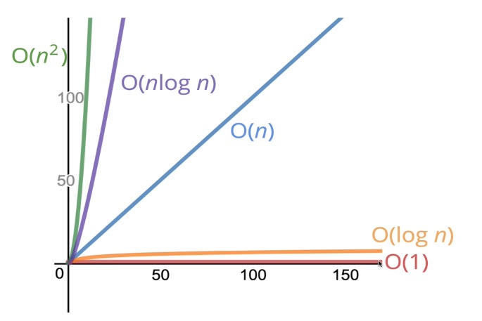

# Big O Notation

## Introduction

Simply saying, Big O Notation is a way to determine the best approach of solving some problem according to performance.

- Big O give us a numeric system to evaluate different algorithms
- it`s important to have a vocabulary to talk about code performance
- we need to discuss _trade-offs_ between approaches
- Big O can be useful to find bottle-necks in your code

**What does better mean?**

- faster
- less memory-intensive
- more readable

**About time**

- time depends on used machines
- same machine can return different time
- speed is not the most important measure if we are talking about fast algorithms

**Operations counting is a way more important**

Lets compare 2 ways to do the save operation:

```js
const addUpToSlow = (n) => {
  let total = 0;
  for (let i = 0; i <= n; i++) total += i;
  return total;
};

const addUpToFast = (n) => (n * (n + 1)) / 2;
```

First method takes a way more time comparing to second: `1.94402 seconds` vs `0.00046 seconds` for `1000000000`.

The same about operations. In the second function we make only 3 operations:

1. n + 1
2. (n + 1) \* n
3. ((n + 1) \* n) / 2

In the first solution we need to:

1. Initialize `total`
2. Initialize `i`
3. Compare `i` with `n`, make `i + 1`, make `total + i` - for **EVERY iteration of _n_**

## What Big O actually is



Is is a way to formalize fuzzy counting. Way to compare how algorithm runtime changes due to input _(relation between inputs and time)_

Big O describes number of operation machine do to run an algo - `O(f(n))`.  
Big O can be:

- linear `f(n) = n`
- quadratic `f(n) = n^2`
- constant `f(n) = 1`
- some other options

For example in this function number of operations does not changes and do not depent on `n`.

```js
const addUpToFast = (n) => (n * (n + 1)) / 2;
```

But here number of operations depends on `n`.

```js
const addUpToSlow = (n) => {
  let total = 0;
  for (let i = 0; i <= n; i++) total += i;
  return total;
};
```

## Simplyfying Expressions

Actually constants and very strict countings are not so important. The main thing we should care about is general trend.  
For example we can use `Rule of Thumb`:

- `O(2n)` -> `O(n)`
- `O(500)` -> `O(1)`
- `O(13n^2)` -> `O(n^2)`
- `O(n^2 + 5n + 8)` -> `O(n^2)`

**Constants:**

- arithmetic operations
- variable assignment
- accessing elements in arrays or objects by index/key

```js
// O(n)
const logAtLeast5(n) {
  for(let i = 1; i <= Math.max(5, n); i++)
    console.log(i);
}

// O(5 | 4 | 3 | 2 | 1) -> O(1)
const logAtMost5(n) {
  for (let i = 1; i <= Math.min(5, n); i++)
    console.log(i);
}
```

## Space Complexity

Auxiliary space complexity - space, required by the algorithm, not including space for the inputs.  
Rules of Thumb:

- most `primitives` (booleans, numbers, undefined, null) require `constant` space
- `string` require `O(n)` space, where `n` is the string lenght
- `reference types` (array, object) are generally `O(n)`, where `n` is the lenght or number of keys

## References & Links

- [Performance Tracker](https://rithmschool.github.io/function-timer-demo/)
